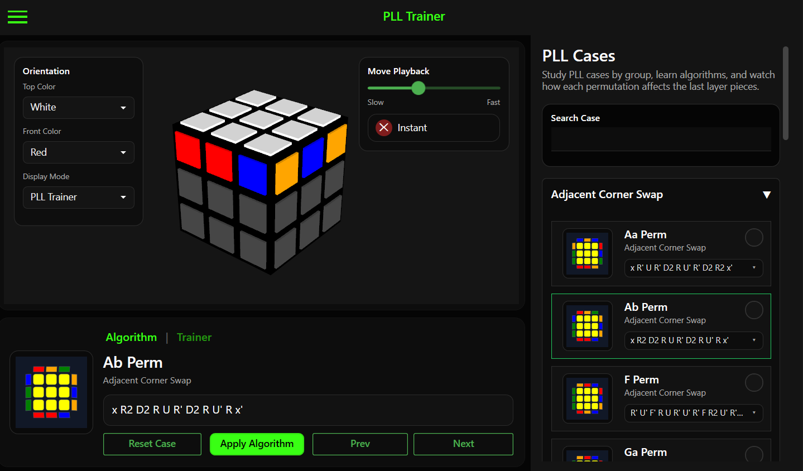
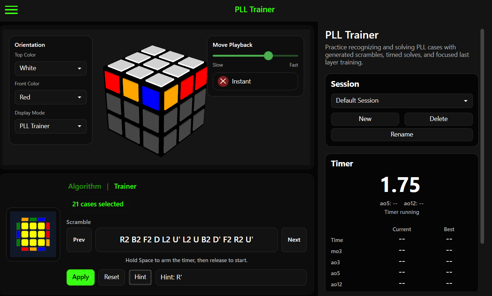
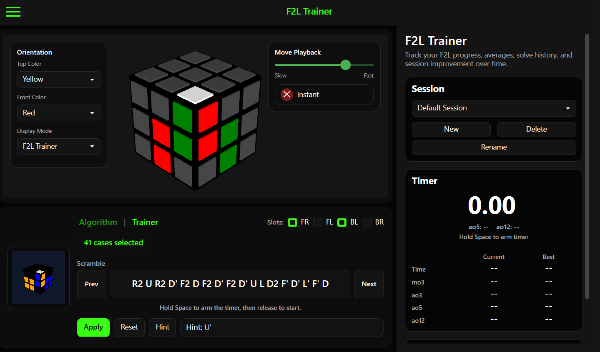
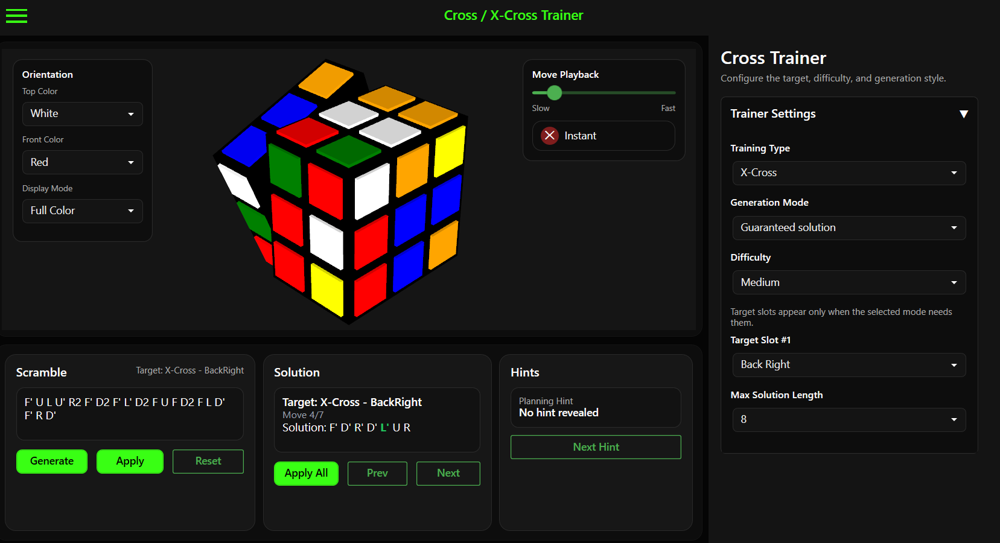

<p align="center">
  
</p>

# CubeForge

CubeForge is a desktop cube training application built with C# and WPF.

It is currently focused on CFOP training, with tools for Cross, F2L, OLL, and PLL practice. The application includes a 3D cube viewer, targeted scramble generation, algorithm playback, timed sessions, and recognition training.

<p align="center">
  
</p>

---

## Technical Highlights

* Built with **C#**, **.NET 8**, and **WPF**
* Interactive **3D cube visualization** and animated move playback
* **Kociemba Two-Phase Solver** with precomputed pruning tables
* Custom **IDA*** search implementation for targeted scramble generation
* Precomputed pruning tables used to reduce search depth and improve performance
* Shared trainer architecture used across multiple training modes
* JSON-based case data and embedded visual assets
* Session tracking and performance statistics

---

## Features

### Interactive Cube Visualization

* Real-time 3D cube rendering
* Adjustable cube orientation
* Animated and instant move playback
* Multiple display modes for focused training
* Direct cube interaction

### Training Modes

* Cross and X-Cross training
* F2L case training
* Last Layer case training
* Recognition practice
* Progressive hints and solution reveals
* Timed sessions and solve history

### Scramble Generation

* Case-specific scramble generation
* Custom training targets
* Difficulty controls
* Guaranteed solution paths

### Solving Tools

* Kociemba Two-Phase Solver
* Cross / X-Cross / XX-Cross Search

---

## Screenshots

### Trainer Mode

Demonstrates the recognition workflow, timer system, hints, and session tracking features.



### Scramble Generation

Example of case specific scramble generation and targeted training configuration.



### Solution Playback

Animated move playback and interactive cube visualization.



---

## Technologies

| Category          | Technology                             |
| ----------------- | -------------------------------------- |
| Language          | C#                                     |
| Framework         | .NET 8                                 |
| UI Framework      | WPF                                    |
| UI Libraries      | MahApps.Metro, Material Design in XAML |
| Search Algorithms | Kociemba Two-Phase Search, IDA*        |
| Data              | JSON, Binary Pruning Tables            |
| Rendering         | Interactive 3D Cube Visualization      |

---

## Project Structure

### Cube

Cube representation, move logic, state management, search algorithms, and solving tools.

### Trainers

Training modes, scramble generation, session tracking, and shared trainer logic.

### Controls

Reusable WPF user interface controls.

### Views

Application pages and trainer screens.

### Data

Case definitions, training data, and pruning tables.

---

## Building From Source

### Requirements

* Visual Studio 2022
* .NET 8 SDK

### Setup

1. Clone the repository.
2. Open `CubeForge.sln`.
3. Restore NuGet packages.
4. Build the solution.

CubeForge requires precomputed pruning tables for fast search and scramble generation.

When **running** from **Visual Studio**, place the pruning tables in the output directory:

```text
bin/
└── Debug/
    └── net8.0-windows/
        └── Data/
            └── PruningTables/
```

For a **release build**, the folder should be placed beside `CubeForge.exe`:

```text
CubeForge.exe
Data/
└── PruningTables/
```

The final release version uses compressed `.bin.gz` pruning table files.

---

## Motivation

CubeForge started as a small Cross and X-Cross trainer. As development continued, it grew into a larger desktop application for studying algorithms, practicing recognition, generating scrambles, and tracking training sessions.

The project was also a way to explore desktop application architecture, search algorithms, performance optimization, and user interface design while building a tool I personally wanted to use.

---

## Future Plans

Possible future additions include:

- Improved threading and background task support
- User profiles and saved training progress
- Web and mobile versions of CubeForge
- Support for additional puzzle types and training modules
- Smart cube / Bluetooth cube integration
- More cube rendering styles and visualization options
- Improved cube map views
- Expanded training statistics and analytics
- Additional customization options
- Additional solving and search tools
- Additional trainer sets such as WV, ZBLS, VLS, and ZBLL